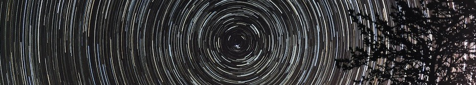

I am an astronomer and PhD student at Astronomical Institute at University of Wroclaw (Poland). Although PhD studies take most of my time, I am trying to find some moments for photography. Mostly I am interested in astrophotography (obviously) but in my gallery day-time photographs also can be found.

In my work I am mostly interested in pulsating stars. Following my passion for photography and observations, I decided to pursue a career in observational astronomy. This involves working with sattelite data and travelling to astronomical observatories all over the world. Currently I am an observer in Bialków Astronomical Observatory which belongs to University of Wroclaw. I have also spent 3 weeks at observational run in the Atacama dessert in Chile. I am also a member of All-sky Light Pollution Survey (ALPS). In this project we aim to raise awareness of light pollution problem by collectic data and measuring the quality of night sky. More on that on the  <a href="https://alps.uwr.edu.pl" target="_blank">official webpage</a>.